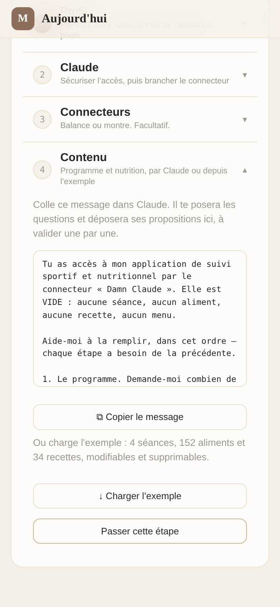
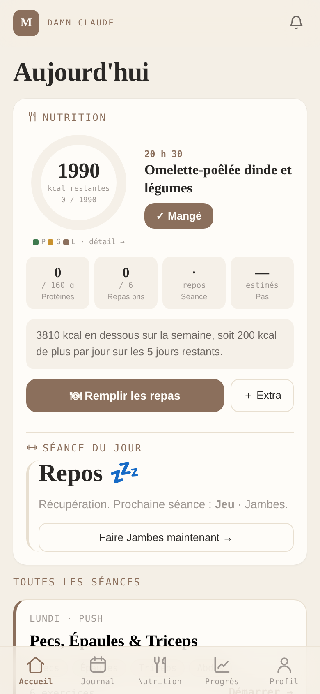
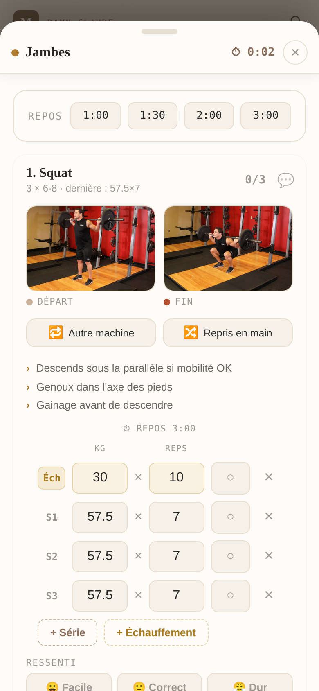
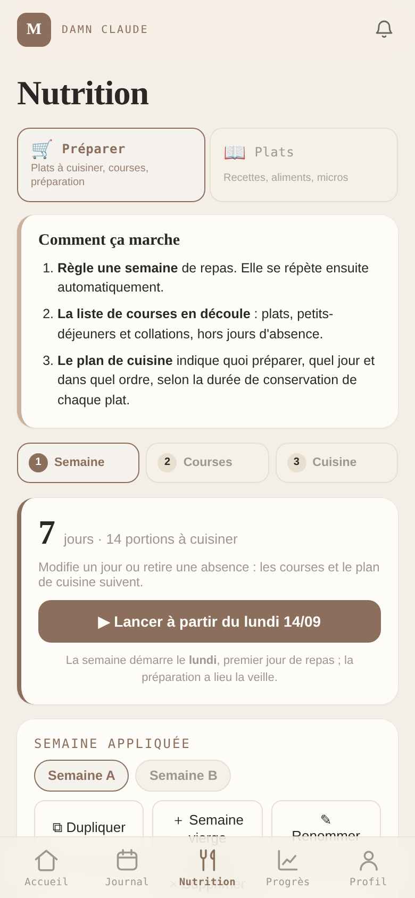

<p align="center">
  
</p>

<p align="center">
  <a href="https://github.com/Gregoire63/damn-claude/actions/workflows/ci.yml"></a>
  
  
  <a href="LICENSE"></a>
  
</p>

<p align="center"><a href="README.md">Français</a> · <b>English</b></p>

# Damn Claude

A training and nutrition tracker that fits in a browser tab, and that **your** Claude
can read — without ever writing on its own.

The name, yes: the one muscle icon who was already called Claude.

> **A note on language.** The codebase, its comments and the rest of the documentation
> are in French — some forty thousand lines of it, and that is deliberate rather than
> accidental. This page is the English entry point; the code you will open is French.

This is a personal application in the strict sense: one instance, one person. No
accounts, no central server, no shared database. Your data lives in your phone's
`localStorage`; the server only holds a mirror that you push yourself, so the
connector has something to read and so you can move between devices.

**→ [HEBERGER.md](HEBERGER.md) (French) to deploy your own in ten minutes.**

<p align="center">
  
  
  
  
</p>

---

## It starts empty

No sessions, no foods, no recipes, no menus. That is on purpose: the shipped content
used to be one person's programme and one person's groceries, and inheriting that is
not starting — it is deleting.

So the first screen offers two paths and nothing else:

- **Let Claude fill it in.** A ready-to-paste message, with the order of the steps —
  programme, weekly template, foods, recipes, menus. Claude asks the questions and
  files its proposals in the app; nothing is written without your approval.
- **Load the example.** Four sessions, one hundred and fifty-two foods, thirty-four
  recipes, two weeks of menus. It comes in through the restore path, so it lands as
  **personal** content: editable, and above all removable. An example you cannot
  remove is not an example.

The pack lives in `data/exemple/`, and `npm run exemple` turns it into
`public/exemple.json`. A test checks that the served file is up to date, byte for byte
— editing the example without regenerating it would leave a stale example online, and
nothing would show it.

---

## What it does

- **Training** — editable programme, set logging during the session, a rest timer that
  buzzes your watch, next-set load suggestions, personal records and stall detection.
- **Nutrition** — a calorie target recomputed from the session you actually recorded,
  meal planning, groceries by aisle, batch cooking, micronutrient coverage.
- **Body** — weigh-ins (by hand or from a connected scale), smoothed curve, weekly
  slope, fat/muscle breakdown, steps.
- **Connector** — an MCP server of your own that Claude reads, and into which it
  **files proposals**. You see them in the app and approve or reject each one with a
  tap. It never modifies anything directly.

## The principle that holds it together

**The phone is the source of truth.** The server never merges, never sends data back
to be reconciled, never decides. It receives a mirror and it keeps an inbox of
proposals. The consequence: there is no case in which two versions of the same session
must be arbitrated — and therefore no conflict to resolve, ever.

That is also what makes self-hosting simple. There is nothing to scale, and nothing to
back up server-side that does not already exist on your phone.

## What it is not

- A service. Nobody operates it for you.
- Multi-user. One instance, one person. That is the model, not a limitation.
- A medical device. The estimates (Mifflin-St Jeor, bioimpedance) are worth exactly
  what their formulas are worth, and say so.

---

## Running it locally

```bash
npm install
npm run dev            # http://localhost:3000
```

In development, demo data is seeded on first load so the screens have something to
show. Never in production. It simulates a history **on the programme in place**: load
the example first (or create a session), otherwise there is nothing to simulate and it
waits.

## Commands

| Command | What it does |
|---|---|
| `npm run dev` | Development server |
| `npm run build` | Production build (**never** `nuxt generate`) |
| `npm test` | 1045 tests, 46 files, two Vitest projects |
| `npm run check` | Three guards: duplicate CSS selectors, duplicate data keys, invalid Vue markup |
| `npm run exemple` | Regenerates `public/exemple.json` from `data/exemple/` |

## How it is laid out

```
app.vue                  design tokens, and the root
layouts/default.vue      the shell — header, tabs, session sheet, mini-bar
pages/                   one file per tab, and nothing but its content
error.vue                404 and server errors
lib/onglets.ts           the five tabs: path, label, title
components/sport/        training screens
components/nutrition/    nutrition screens
composables/             state, persisted in localStorage (23 files, no Pinia)
lib/                     pure logic — no DOM, no storage, tested (18 files)
data/                    types and reference tables — the contents are empty
data/exemple/            the example pack, converted into public/exemple.json
server/api/              the MCP connector, OAuth, passkey, scales (31 routes)
```

Three layout rules explain the rest:

**`lib/` is not auto-imported, `utils/` is.** Nuxt pours all of `utils/` and
`composables/` into the global namespace. A function called `clamp` or `slugify` has
no business being there — a silent collision on the first rename. Anything generic
therefore lives in `lib/`, with explicit imports.

**One tab, one URL, one file.** `/`, `/journal`, `/nutrition`, `/progres`, `/profil`.
The current tab is stored nowhere: it is read from the URL. An unknown path matches no
page, and since it is absent from the `ssr: false` rules in `nuxt.config`, it is
server-rendered — and therefore refused with a real 404, not a 200 followed by a page
that changes its mind.

**Whatever survives a tab change lives in the shell.** The session sheet is a LAYER on
top of the current tab, not a piece of one: you start a session from the home screen,
collapse it, go check a load in the journal, reopen it. Its state lives in
`useSeance()` — outside any component, in a detached `effectScope`, so the timer and
the autosave do not die with the screen that created them.

## Under the hood

Four choices that shape the code, and that you would not guess by reading it.

**The guards are not tests.** `npm run check` runs three in-house scripts that read the
sources and reject what no test would catch: a CSS selector defined twice (the second
rule wins, silently), a duplicate data key, a malformed Vue tag. They run in two
seconds.

**Two tests protect against invisible regressions.** `mcpCoherence` confronts the MCP
tool description with the code that applies it: an operation the code accepts but does
not advertise will never be called, and an advertised operation the code refuses
produces rejected filings nobody can explain. `sauvegarde` scans the `*_KEY` constants
in the composables and requires each one to reach the export, or to appear in an
exclusion list **with a written reason** — a forgotten key is data that does not come
back from an import.

**The server remembers nothing.** HMAC tokens carrying their own expiry, and a Netlify
Blobs client rebuilt on every operation — the Blobs context is injected per invocation
with a short-lived token, and memoising it freezes a token that expires after about
twenty minutes of a warm instance. So never in tests, always in production.

**Comments say why, not what.** There are many, deliberately: each one records the bug
it prevents from coming back. `overflow-x: hidden` creates a scroll container and kills
`position: sticky`; the minifier keeps only `-webkit-backdrop-filter`, which Chromium
no longer supports. Those two cost an evening each.

## Documentation

- **[HEBERGER.md](HEBERGER.md)** *(FR)* — deploying, setting the variables, wiring
  Claude, wiring a scale.
- **[SKILL.md](SKILL.md)** *(FR)* — the skill to install in Claude so it knows how to
  use the connector.
- **[docs/NUTRITION.md](docs/NUTRITION.md)** *(FR)* — the decisions behind the
  nutrition module: what was tried, what broke, why the code looks like this.
- **[CLAUDE.md](CLAUDE.md)** *(FR)* — bearings for working in the repository:
  structure, the rules that bite, conventions. Written for an agent, useful to a human.
- **[CONTRIBUTING.md](CONTRIBUTING.md)** · **[SECURITY.md](SECURITY.md)** *(FR)*

## Licence

**GNU AGPL v3** — see [LICENSE](LICENSE).

In plain terms, for the two cases that actually come up:

- **You host your own instance, for yourself.** Go ahead — that is exactly what the
  application is written for. You owe nobody anything, you have nothing to publish,
  you change whatever you want.
- **You run it as a service for other people.** Then your modifications must be
  public, under the same licence. The AGPL closes the door the GPL leaves open:
  serving over a network counts as distributing.

A commercial licence, for anyone who wants to exploit the code without publishing
their modifications, is open to discussion — get in touch.

Copyright © 2026 Grégoire Raturat.
